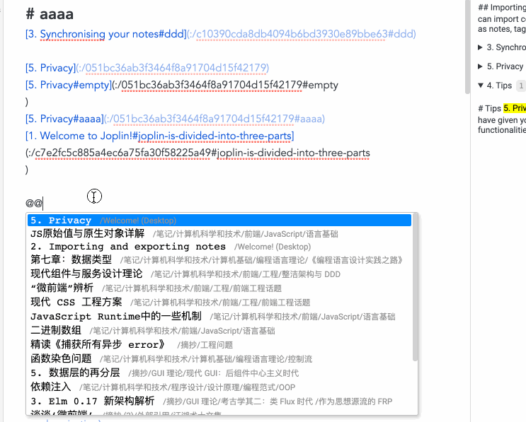

# Joplin Note Link System

Discussion: https://discourse.joplinapp.org/t/plugin-note-link-system/21768

## Features

All features can be turn on/off.

### Main Feature 1: Referrers

- Show referrer list on panel or markdown view(auto or manually)
- Display reference's detail of every referrer
- Show referrer of every element with id
- Jump and scroll to reference

### Main Feature 2: Quick Link

This feature helps you make quick link to note or element with id, and auto select title text so you can updated it.

### Main Feature 3: Quick Copy Element URL

### Main Feature 4: Preview local/remote URL

## Thanks

Basically, this plugin is inspired by:

- [Automatic backlinks (with manual insert option)](https://discourse.joplinapp.org/t/automatic-backlinks-with-manual-insert-option/13632)
- [Plugin: Copy Anchor Link](https://discourse.joplinapp.org/t/plugin-copy-anchor-link/21690)
- [Quick Links Plugin](https://discourse.joplinapp.org/t/quick-links-plugin/14214)
- [Plugin: Links Metadata 4](https://discourse.joplinapp.org/t/plugin-links-metadata/14915) (not implement yet)

## RoadMap

- Style beautifying
- Support Quick Link to current note
- Support finding referrer of current note
- An Outlink panel to show links(to other Joplin note or Web page) in current note.
- ...

Any PR / Issue / Discussion is welcome!
